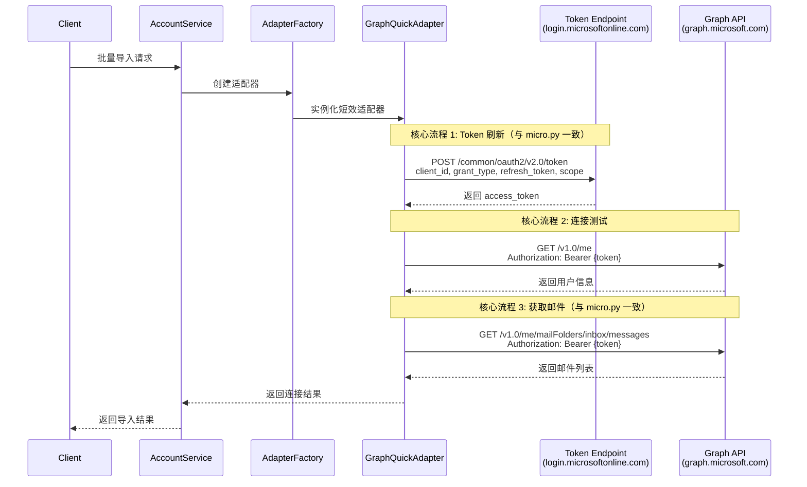
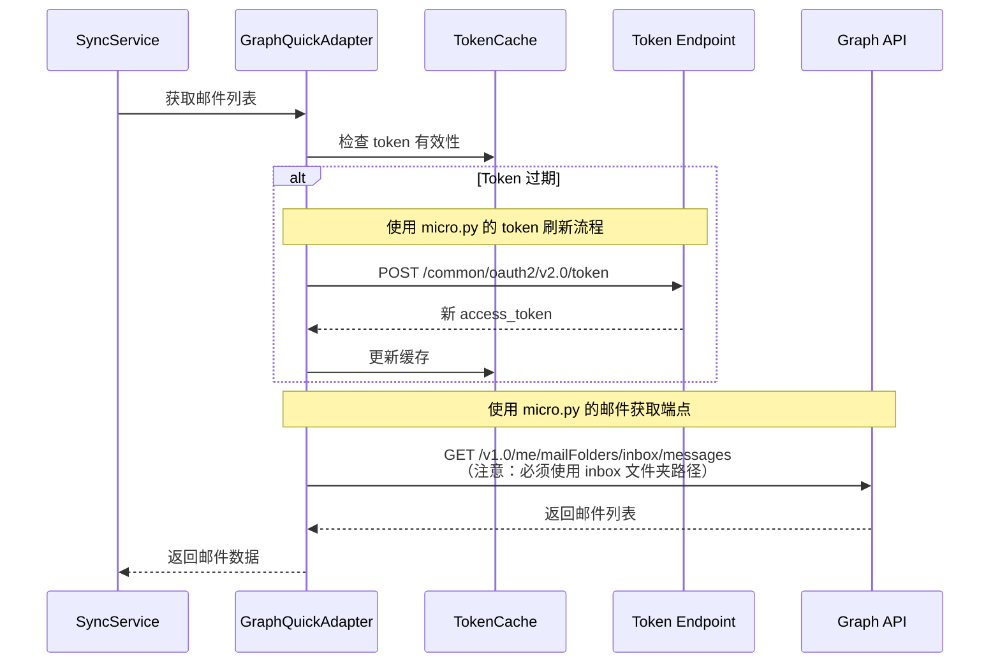

# 短效邮箱适配器设计文档

## 概述

短效邮箱适配器是一个专门为 Microsoft Outlook/Hotmail 账户设计的轻量级邮件访问组件。它采用简化的认证流程，直接使用 refresh_token 和 client_id 获取 access_token，避免了复杂的 OAuth2 授权码流程，特别适用于批量导入、测试验证等场景。

**设计原则**：短效邮箱适配器的核心实现必须与 `backend/micro.py` 参考实现保持完全一致，确保邮件接收功能的正确性。所有扩展功能都应该在核心流程之上构建，不能改变核心流程的行为。

### 参考实现分析（micro.py）

```python
# 核心流程 1: Token 刷新
def get_access_token(refresh_token: str, client_id: str) -> str:
    res = requests.post(
        "https://login.microsoftonline.com/common/oauth2/v2.0/token",
        data={
            "client_id": client_id,
            "grant_type": "refresh_token",
            "refresh_token": refresh_token,
            "scope": "https://graph.microsoft.com/.default"
        }
    )
    return res.json()["access_token"]

# 核心流程 2: 获取收件箱邮件
def print_inbox(access_token: str) -> None:
    res = requests.get(
        "https://graph.microsoft.com/v1.0/me/mailFolders/inbox/messages",
        headers={"Authorization": f"Bearer {access_token}"},
    )
    res.raise_for_status()
    for m in res.json().get("value", []):
        # 处理邮件数据
```

**关键要点**：
1. Token 端点：`https://login.microsoftonline.com/common/oauth2/v2.0/token`
2. 邮件端点：`https://graph.microsoft.com/v1.0/me/mailFolders/inbox/messages`（注意是 inbox 文件夹，不是 /me/messages）
3. 请求方法：POST（token）、GET（邮件）
4. 认证头：`Bearer {access_token}`
5. Scope：`https://graph.microsoft.com/.default`

## 架构设计

### 整体架构

```
┌─────────────────────────────────────────────────────────────┐
│                    FusionMail 系统                          │
├─────────────────────────────────────────────────────────────┤
│                  适配器选择层                                │
│  ┌─────────────────┐    ┌─────────────────────────────────┐  │
│  │  AdapterFactory │    │     AccountService              │  │
│  └─────────────────┘    └─────────────────────────────────┘  │
├─────────────────────────────────────────────────────────────┤
│                    适配器实现层                              │
│  ┌─────────────────┐    ┌─────────────────────────────────┐  │
│  │ GraphQuickAdapter│    │      GraphAdapter              │  │
│  │   (短效处理)     │    │    (标准 OAuth2)               │  │
│  └─────────────────┘    └─────────────────────────────────┘  │
├─────────────────────────────────────────────────────────────┤
│                   Microsoft Graph API                      │
└─────────────────────────────────────────────────────────────┘
```

### 核心组件

#### 1. GraphQuickAdapter

**职责**: 实现基于 refresh_token 的快速认证和邮件访问

**核心特性**:
- 直接 token 刷新机制
- 简化的错误处理
- 高性能的并发支持
- 最小化的依赖

#### 2. AdapterFactory

**职责**: 根据账户配置选择合适的适配器

**选择逻辑**:
```go
func (f *AdapterFactory) CreateAdapter(config *Config) (MailProvider, error) {
    if config.AuthType == "quick" || (config.RefreshToken != "" && config.ClientID != "") {
        return NewGraphQuickAdapter(config)
    }
    return NewGraphAdapter(config)
}
```

#### 3. QuickAuthService

**职责**: 管理短效认证的生命周期

**功能**:
- Token 缓存和刷新
- 批量认证处理
- 错误重试机制

## 数据模型

### 账户配置模型

```go
type QuickAuthConfig struct {
    Email        string `json:"email"`
    RefreshToken string `json:"refresh_token"` // AES-256 加密存储
    ClientID     string `json:"client_id"`
    AuthType     string `json:"auth_type"`     // "quick" 或 "standard"
}
```

### 认证响应模型

```go
type TokenResponse struct {
    AccessToken  string `json:"access_token"`
    TokenType    string `json:"token_type"`
    ExpiresIn    int    `json:"expires_in"`
    Scope        string `json:"scope"`
    Error        string `json:"error,omitempty"`
    ErrorDesc    string `json:"error_description,omitempty"`
}
```

### 批量导入模型

```go
type BatchImportRequest struct {
    Accounts []string `json:"accounts"` // 格式: email----password----refresh_token----client_id
}

type BatchImportResponse struct {
    Success int                    `json:"success"`
    Failed  int                    `json:"failed"`
    Results []ImportResult         `json:"results"`
}

type ImportResult struct {
    Email  string `json:"email"`
    Status string `json:"status"` // "success" 或 "failed"
    Error  string `json:"error,omitempty"`
}
```

## 接口设计

### MailProvider 接口

```go
type MailProvider interface {
    Connect(ctx context.Context) error
    Disconnect() error
    TestConnection(ctx context.Context) error
    FetchEmails(ctx context.Context, since time.Time, limit int) ([]*Email, error)
    FetchEmailDetail(ctx context.Context, providerID string) (*Email, error)
    GetProviderType() string
    GetProtocol() string
}
```

### QuickAuthProvider 接口

```go
type QuickAuthProvider interface {
    MailProvider
    RefreshToken(ctx context.Context) error
    GetTokenExpiry() time.Time
    IsTokenValid() bool
}
```

## 组件交互

### 认证流程（必须与 micro.py 一致）



### 邮件获取流程（必须与 micro.py 一致）



**重要说明**：
- 核心邮件获取必须使用 `/me/mailFolders/inbox/messages` 端点（与 micro.py 一致）
- 不能使用 `/me/messages` 端点作为核心实现
- 扩展功能可以使用其他端点，但核心流程必须保持一致

## 错误处理策略

### 错误分类

1. **认证错误** (4xx)
   - 401: Token 无效或过期
   - 403: 权限不足
   - 处理: 尝试刷新 token，失败则标记账户异常

2. **网络错误** (5xx, 网络超时)
   - 500: 服务器内部错误
   - 502/503: 服务不可用
   - 处理: 指数退避重试，最多 3 次

3. **配置错误**
   - 无效的 client_id 格式
   - 缺失必要参数
   - 处理: 立即返回错误，不重试

### 重试机制

```go
type RetryConfig struct {
    MaxRetries    int           `default:"3"`
    BaseDelay     time.Duration `default:"1s"`
    MaxDelay      time.Duration `default:"30s"`
    BackoffFactor float64       `default:"2.0"`
}
```

## 性能优化

### Token 缓存策略

- **内存缓存**: 使用 sync.Map 存储活跃的 access_token
- **过期管理**: 提前 5 分钟刷新即将过期的 token
- **并发控制**: 使用 singleflight 避免重复的 token 刷新请求

### 连接池管理

```go
type ConnectionPool struct {
    maxConnections int
    activeConns    map[string]*GraphQuickAdapter
    mutex          sync.RWMutex
}
```

### 批量处理优化

- **并发限制**: 最多 10 个并发连接
- **分批处理**: 每批最多 50 个账户
- **超时控制**: 单个账户处理超时 30 秒

## 安全考虑

### 数据加密

- **Refresh Token**: 使用 AES-256-GCM 加密存储
- **Access Token**: 仅在内存中保存，不持久化
- **日志安全**: 敏感信息使用 `***` 掩码

### 访问控制

- **API 认证**: 所有请求需要有效的 JWT token
- **权限验证**: 验证用户对账户的操作权限
- **审计日志**: 记录所有敏感操作

## 测试策略

### 单元测试

- **适配器功能**: 测试 token 刷新、API 调用等核心功能
- **错误处理**: 测试各种错误场景的处理逻辑
- **并发安全**: 测试多线程环境下的数据一致性

### 集成测试

- **API 交互**: 使用真实的 Microsoft Graph API 进行测试
- **端到端流程**: 测试从账户导入到邮件同步的完整流程
- **性能测试**: 测试批量处理的性能和稳定性

### 模拟测试

- **Mock Server**: 模拟 Microsoft Graph API 响应
- **错误注入**: 模拟网络错误、API 错误等异常情况
- **边界测试**: 测试极限情况下的系统行为

## 部署和监控

### 配置管理

```yaml
quick_auth:
  enabled: true
  max_concurrent_connections: 10
  token_cache_ttl: 3600s
  retry_config:
    max_retries: 3
    base_delay: 1s
    max_delay: 30s
```

### 监控指标

- **成功率**: 认证成功率、API 调用成功率
- **性能**: 响应时间、吞吐量
- **错误**: 错误类型分布、重试次数
- **资源**: 内存使用、连接数

### 告警规则

- 认证成功率低于 95%
- API 调用平均响应时间超过 5 秒
- 错误率超过 5%
- 内存使用超过阈值

## 扩展性设计

### 多提供商支持

设计支持扩展到其他邮件提供商的短效认证方式：

```go
type QuickAuthProvider interface {
    GetProviderType() string // "outlook", "gmail", "yahoo"
    RefreshToken(ctx context.Context, config *QuickAuthConfig) (*TokenResponse, error)
    TestConnection(ctx context.Context, token string) error
}
```

### 插件化架构

支持通过插件方式添加新的认证方式和功能扩展。

## 迁移策略

### 从标准适配器迁移

1. **渐进式迁移**: 支持两种适配器并存
2. **配置驱动**: 通过配置选择使用的适配器类型
3. **数据兼容**: 确保两种适配器的数据格式兼容
4. **回滚机制**: 支持快速回滚到标准适配器