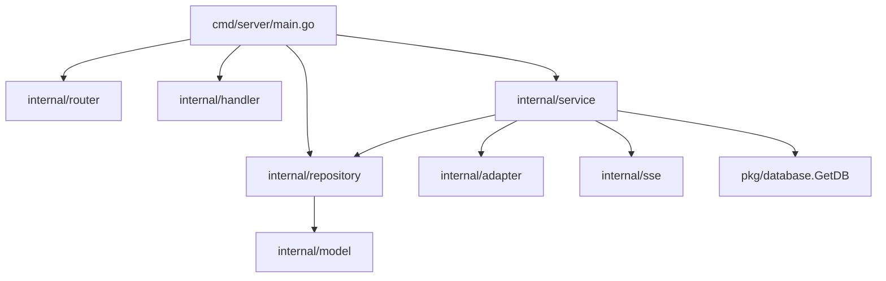
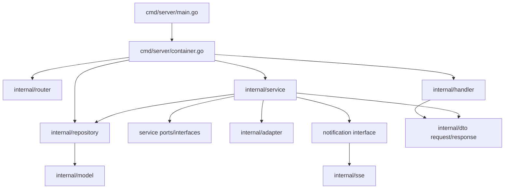
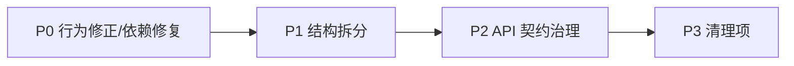
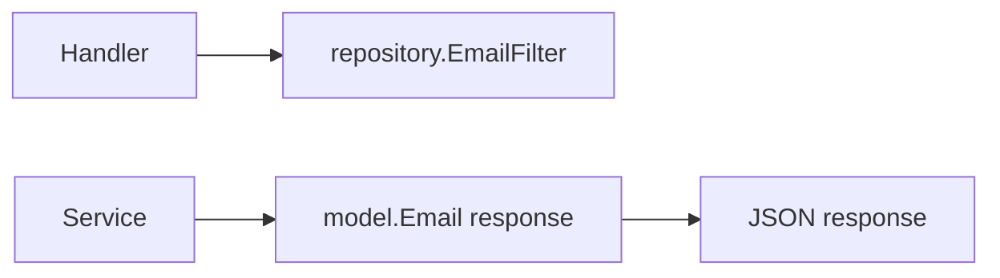
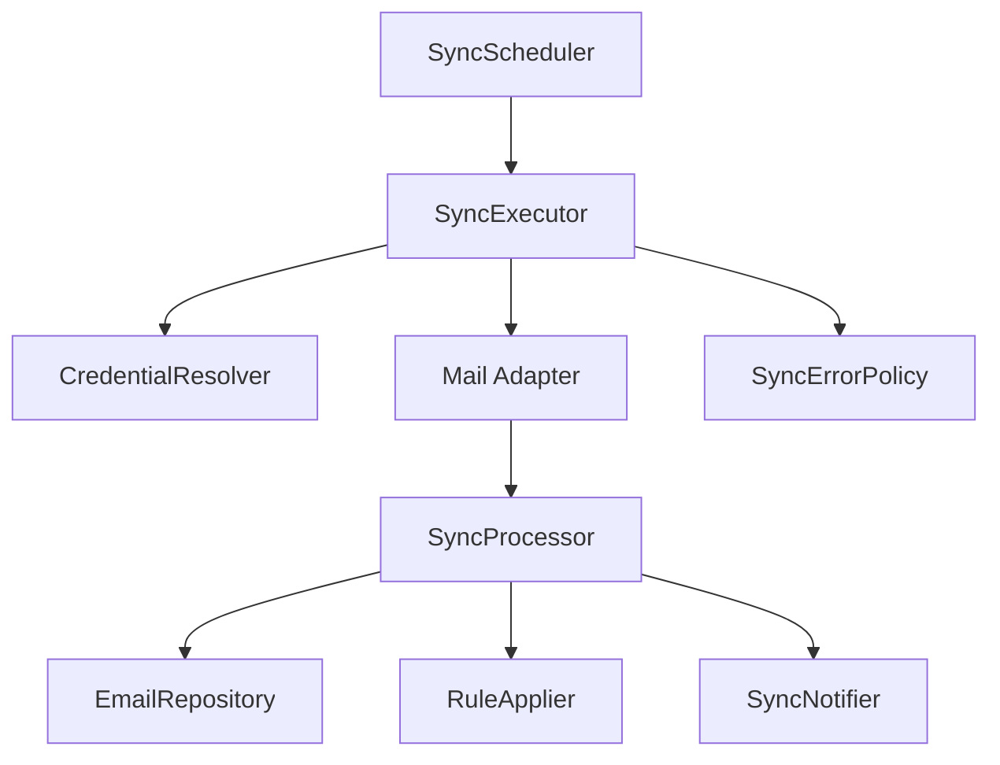

# Backend Architecture Standardization Design

## Objective

将后端架构调整为适合中型 Go 项目长期维护的结构：明确模块职责、减少跨层泄漏、降低超大文件复杂度、消除临时依赖绕过路径，并保持现有业务行为稳定。

## Architecture Direction

### Current Shape

当前主要数据和依赖方向：



问题在于：

- `main.go` 既是入口，又是依赖容器，又是运行时生命周期管理器。
- service 层除了依赖 repository，还直接依赖 SSE 和全局 DB。
- handler 层可直接构造 repository filter，跨过 service 的业务输入边界。
- model 直接作为 API response，存储细节进入外部契约。

### Target Shape

目标依赖方向：



核心原则：

1. `main.go` 只描述启动流程，不承载完整依赖图。
2. service 层依赖显式接口，不主动调用全局 DB。
3. API contract 由 DTO 承载，不由 GORM model 承载。
4. 复杂业务模块按状态机/责任链拆文件，而不是按随意行数拆。
5. 大规模结构调整必须分阶段，不与行为修复混合。

## Key Decisions

### Decision 1: DI 采用手动容器，不引入 wire/fx

理由：

- 当前依赖图主要是 `handler -> service -> repository`，复杂度可控。
- wire 需要额外 provider 声明，对本项目收益不明显。
- fx 引入运行时生命周期框架，超出当前问题规模。
- 手动 `buildContainer()` 可渐进迁移，diff 更可控。

目标结构：

```go
type AppContainer struct {
    Repositories *Repositories
    Services     *Services
    Handlers     *Handlers
    Runtime      *RuntimeResources
}
```

### Decision 2: P0 先修行为和依赖漏洞，P1 再拆结构

`sync_service.go` 存在批处理计数风险，同时又是 P1 最大拆分对象。如果先拆文件，会让行为修复混入结构 diff，review 成本过高。

顺序固定为：



### Decision 3: 凭证解析作为 service 内部基础能力

凭证解析包含业务上下文：账号类型、provider 配置、OAuth2 client、quick account 兼容、协议默认值。因此它不放到 `pkg/`，而应放在 `internal/service` 或后续 `internal/domain/account` 下。

短期目标：`internal/service/credential_resolver.go`。

### Decision 4: SSE 收敛为轻量通知接口，不立刻引入完整事件总线

当前问题是 service 直接调用 `sse.Broadcast`，但还不需要引入复杂事件总线。P0 使用轻量接口：

```go
type SyncNotifier interface {
    EmailCountsMaybeChanged(ctx context.Context, payload any)
    SyncProgress(ctx context.Context, payload any)
}
```

后续如果通知目标扩展到 WebSocket、队列、审计日志，再考虑事件总线。

### Decision 5: DTO 治理逐步推进，不全量重写 API

P2 先处理核心高风险实体：Email、Account、Sync status。新增 API 不再直接返回 model；历史 API 按频率和风险迁移。

## Module Boundaries

### cmd/server

职责：

- 环境和配置加载
- 数据库和外部连接初始化
- 依赖容器组装
- HTTP server 生命周期
- graceful shutdown

不负责：

- 业务规则
- 具体 repository/service 内部构造细节
- 大段 seed 数据

### internal/service

职责：

- 业务流程编排
- 事务边界策略
- 调用 repository、adapter、notifier 等端口

不负责：

- HTTP 参数解析
- 直接管理全局 DB
- 暴露 GORM model 作为外部契约

### internal/repository

职责：

- 数据查询和持久化
- SQL/GORM 查询优化
- 存储模型映射

不负责：

- HTTP/API 输入格式
- 业务状态机策略
- SSE 通知

### internal/adapter

职责：

- 外部邮件协议和第三方服务适配
- IMAP/POP3/Gmail/Graph/WebAPI 协议边界

不负责：

- 业务持久化
- API response shaping

### internal/dto

职责：

- HTTP request / response contract
- 错误响应结构
- API 文档可见类型

不负责：

- GORM 存储结构
- 复杂业务流程

## Data Flow Targets

### Email list/detail

目标：

```mermaid
flowchart LR
    HTTP[HTTP query/path] --> Handler[handler request parsing]
    Handler --> ServiceInput[service query/input]
    ServiceInput --> Service[EmailService]
    Service --> RepoFilter[repository filter]
    RepoFilter --> Repo[EmailRepository]
    Repo --> Model[model.Email]
    Model --> ResponseDTO[Email response DTO]
    ResponseDTO --> HTTPResponse[JSON response]
```



禁止新增：



### Sync flow

目标职责拆分：



## File Size Policy

- 普通 service 文件目标 < 500 行。
- 超过 600 行需要有明确原因：协议实现、生成文件、复杂第三方适配器等。
- 文件拆分按职责，不按机械行数。
- generated files（如 `docs/docs.go`）不纳入人工拆分目标。

## Compatibility Strategy

- 每阶段必须保持外部行为兼容，除 P0 明确修复的计数 bug。
- P2 DTO 引入时保持 JSON 字段兼容，前端不应被迫一次性改动。
- 结构拆分阶段避免格式化无关文件。
- 移动文件时优先保持 package 不变，降低 import churn。

## Risk Controls

- 同步引擎相关变更必须最小化并有测试。
- 大文件拆分前后用 `go test ./...` 验证。
- API 契约变更前后对照 Swagger 或前端 service 依赖。
- 每阶段可单独回滚，不跨阶段混合提交。