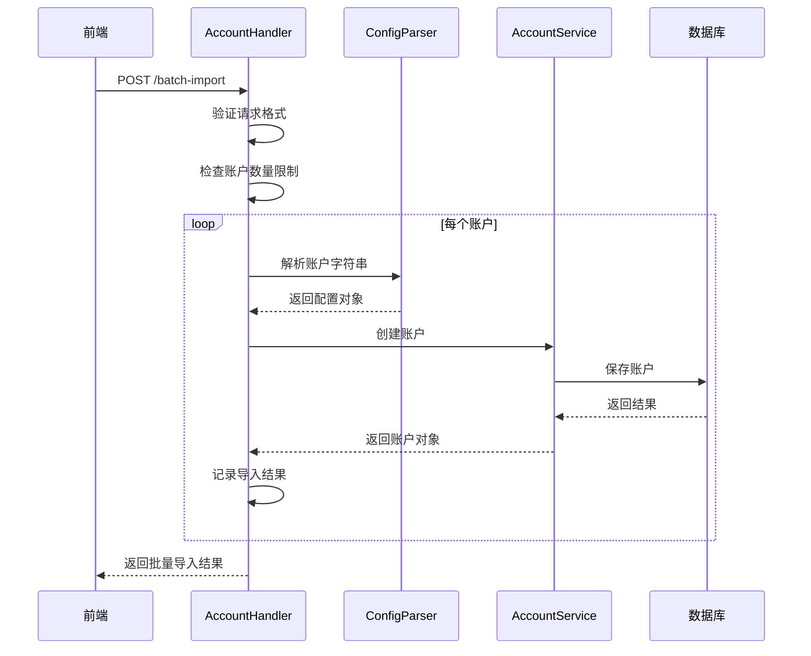

# 批量导入 API 实现文档

## 📋 概述

批量导入 API 允许一次性导入多个短效邮箱账户，提供高效的账户批量管理功能。

**实现日期**: 2025-11-04  
**API 版本**: v1  
**状态**: ✅ 已完成

## 🔌 API 端点

### 批量导入账户

**端点**: `POST /api/v1/accounts/batch-import`

**认证**: 需要 JWT Token

**请求头**:
```
Content-Type: application/json
Authorization: Bearer {token}
```

**请求体**:
```json
{
  "accounts": [
    "email1----password1----refresh_token1----client_id1",
    "email2----password2----refresh_token2----client_id2"
  ]
}
```

**响应**:
```json
{
  "success": true,
  "data": {
    "success": 2,
    "failed": 0,
    "results": [
      {
        "email": "email1@example.com",
        "status": "success"
      },
      {
        "email": "email2@example.com",
        "status": "success"
      }
    ]
  }
}
```

## 📁 实现文件

### 1. Handler 层

**文件**: `backend/internal/handler/account_handler.go`

**新增方法**:
- `BatchImport(c *gin.Context)` - 批量导入处理器
- `importSingleAccount(ctx context.Context, accountString string)` - 单个账户导入
- `extractEmailFromString(accountString string)` - 提取邮箱地址

**新增结构**:
```go
type BatchImportRequest struct {
    Accounts []string `json:"accounts" binding:"required"`
}

type BatchImportResponse struct {
    Success int                 `json:"success"`
    Failed  int                 `json:"failed"`
    Results []BatchImportResult `json:"results"`
}

type BatchImportResult struct {
    Email  string `json:"email"`
    Status string `json:"status"` // "success" 或 "failed"
    Error  string `json:"error,omitempty"`
}
```

### 2. Router 层

**文件**: `backend/internal/router/router.go`

**新增路由**:
```go
accounts.POST("/batch-import", accountHandler.BatchImport)
```

**注意**: 必须放在 `accounts.POST("")` 之后，避免路由冲突。

### 3. Service 层

**文件**: `backend/internal/service/account_service.go`

**修改内容**:
- 更新 `CreateAccountRequest` 结构，添加短效认证字段：
  - `RefreshToken string`
  - `ClientID string`
- 将 `Password` 字段改为可选（移除 `binding:"required"`）

## 🔄 处理流程



## 🛡️ 安全措施

### 1. 认证和授权

- ✅ 需要有效的 JWT Token
- ✅ 通过认证中间件验证
- ✅ 速率限制保护

### 2. 输入验证

- ✅ 验证请求格式
- ✅ 验证账户字符串格式
- ✅ 限制批量导入数量（最多 50 个）

### 3. 错误隔离

- ✅ 单个账户失败不影响其他账户
- ✅ 详细的错误信息记录
- ✅ 返回每个账户的导入状态

### 4. 数据保护

- ✅ RefreshToken 加密存储
- ✅ 敏感信息不记录到日志
- ✅ HTTPS 传输加密

## 📊 限制和约束

### 请求限制

| 限制项 | 值 | 说明 |
|--------|-----|------|
| 单次最大账户数 | 50 | 避免请求超时 |
| 请求超时 | 30秒 | Gin 默认超时 |
| 速率限制 | 200次/分钟 | 全局 API 限制 |

### 账户格式要求

- 必须使用 `----` 分隔符
- 必须包含 4 个字段
- Email 必须是有效的邮箱格式
- RefreshToken 和 ClientID 不能为空

## 🧪 测试

### 单元测试

**测试文件**: `backend/internal/handler/account_handler_test.go`（待创建）

**测试用例**:
```go
func TestBatchImport_Success(t *testing.T) {
    // 测试成功导入
}

func TestBatchImport_InvalidFormat(t *testing.T) {
    // 测试格式错误
}

func TestBatchImport_ExceedLimit(t *testing.T) {
    // 测试超过数量限制
}

func TestBatchImport_PartialFailure(t *testing.T) {
    // 测试部分失败
}
```

### 集成测试

**测试脚本**: `backend/scripts/test_batch_import.sh`

**使用方法**:
```bash
cd backend/scripts
./test_batch_import.sh
```

### 手动测试

**使用 curl**:
```bash
curl -X POST http://localhost:3333/api/v1/accounts/batch-import \
  -H "Content-Type: application/json" \
  -H "Authorization: Bearer YOUR_TOKEN" \
  -d '{
    "accounts": [
      "email@outlook.com----pass----token----client_id"
    ]
  }'
```

## 📈 性能考虑

### 当前实现

- **处理方式**: 串行处理（逐个导入）
- **优点**: 简单可靠，错误隔离好
- **缺点**: 大批量导入较慢

### 性能指标

| 账户数 | 预计时间 | 说明 |
|--------|----------|------|
| 1-10 | < 10秒 | 快速 |
| 10-30 | 10-30秒 | 正常 |
| 30-50 | 30-60秒 | 较慢 |

### 优化建议

**未来可以考虑**:
1. **并发处理**: 使用 goroutine 并发导入
2. **批量插入**: 数据库批量操作
3. **异步处理**: 返回任务 ID，后台处理
4. **进度推送**: WebSocket 实时进度

## 🔍 错误处理

### 错误类型

1. **请求格式错误** (400)
   ```json
   {
     "success": false,
     "error": "请求格式错误: ..."
   }
   ```

2. **账户数量超限** (400)
   ```json
   {
     "success": false,
     "error": "单次最多导入 50 个账户"
   }
   ```

3. **账户格式错误**
   - 在结果中标记为失败
   - 不影响其他账户导入

4. **创建账户失败**
   - 在结果中标记为失败
   - 包含具体错误信息

### 错误响应示例

```json
{
  "success": true,
  "data": {
    "success": 1,
    "failed": 1,
    "results": [
      {
        "email": "valid@outlook.com",
        "status": "success"
      },
      {
        "email": "invalid@outlook.com",
        "status": "failed",
        "error": "账户格式错误: invalid refresh token"
      }
    ]
  }
}
```

## 📝 使用示例

### JavaScript/TypeScript

```typescript
async function batchImport(accounts: string[]) {
  const response = await fetch('/api/v1/accounts/batch-import', {
    method: 'POST',
    headers: {
      'Content-Type': 'application/json',
      'Authorization': `Bearer ${token}`
    },
    body: JSON.stringify({ accounts })
  });
  
  const result = await response.json();
  return result.data;
}
```

### Go

```go
type BatchImportRequest struct {
    Accounts []string `json:"accounts"`
}

func batchImport(accounts []string, token string) (*BatchImportResponse, error) {
    req := BatchImportRequest{Accounts: accounts}
    body, _ := json.Marshal(req)
    
    httpReq, _ := http.NewRequest("POST", 
        "http://localhost:3333/api/v1/accounts/batch-import", 
        bytes.NewBuffer(body))
    httpReq.Header.Set("Content-Type", "application/json")
    httpReq.Header.Set("Authorization", "Bearer "+token)
    
    resp, err := http.DefaultClient.Do(httpReq)
    // ... 处理响应
}
```

### Python

```python
import requests

def batch_import(accounts, token):
    response = requests.post(
        'http://localhost:3333/api/v1/accounts/batch-import',
        headers={
            'Content-Type': 'application/json',
            'Authorization': f'Bearer {token}'
        },
        json={'accounts': accounts}
    )
    return response.json()['data']
```

## 🔗 相关文档

- [前端批量导入实现](../../frontend/docs/batch-import-implementation.md)
- [批量导入使用指南](../../frontend/docs/batch-import-guide.md)
- [短效邮箱适配器设计](../../.kiro/specs/short-term-email-adapter/design.md)
- [micro.py 对齐测试报告](./micro-alignment-test-report.md)

## 📋 变更日志

### v1.0.0 (2025-11-04)

**新增**:
- ✅ 批量导入 API 端点
- ✅ 账户字符串解析
- ✅ 错误隔离机制
- ✅ 详细结果报告

**修改**:
- ✅ CreateAccountRequest 添加短效认证字段
- ✅ Password 字段改为可选

**测试**:
- ✅ 集成测试脚本
- ⏳ 单元测试（待完成）

## 🎯 后续改进

### 短期

- [ ] 添加单元测试
- [ ] 添加并发处理
- [ ] 优化性能

### 中期

- [ ] 异步处理支持
- [ ] WebSocket 进度推送
- [ ] 批量操作审计日志

### 长期

- [ ] 支持其他提供商批量导入
- [ ] 导入模板管理
- [ ] 导入历史记录
