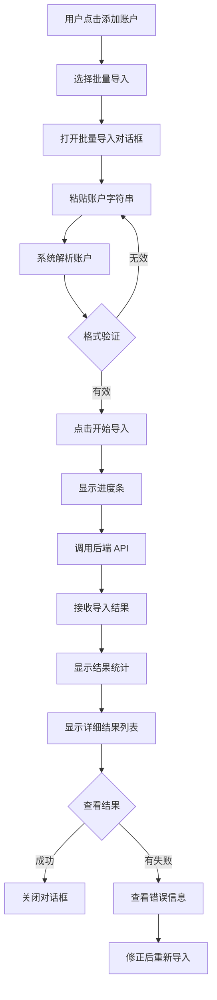

# 前端批量导入功能实现总结

## 📋 实现概述

为 FusionMail 前端添加了短效邮箱批量导入功能，允许用户一次性导入多个短效邮箱账户。

**实现日期**: 2025-11-04  
**状态**: ✅ 已完成

## 🎯 实现的功能

### 1. 批量导入对话框组件

**文件**: `frontend/src/components/account/BatchImportDialog.tsx`

**功能特性**:
- ✅ 账户字符串输入和解析
- ✅ 格式说明和验证
- ✅ 实时进度显示
- ✅ 导入结果统计（成功/失败）
- ✅ 详细的导入结果列表
- ✅ 错误信息展示

**UI 组件**:
- 文本输入框（Textarea）
- 进度条（Progress）
- 滚动区域（ScrollArea）
- 状态图标（CheckCircle2, XCircle, Loader2）
- 提示信息（Alert）

### 2. API 服务扩展

**文件**: `frontend/src/services/accountService.ts`

**新增方法**:
```typescript
batchImport: async (accounts: string[]): Promise<{
  success: number;
  failed: number;
  results: Array<{
    email: string;
    status: 'success' | 'failed';
    error?: string;
  }>;
}>
```

**功能**:
- 调用后端批量导入 API
- 处理导入结果
- 错误处理和重试

### 3. 账户页面集成

**文件**: `frontend/src/pages/AccountsPage.tsx`

**修改内容**:
- ✅ 添加批量导入按钮（下拉菜单）
- ✅ 集成批量导入对话框
- ✅ 实现导入结果处理
- ✅ 添加成功/失败通知

**UI 改进**:
- 将"添加账户"按钮改为下拉菜单
- 提供"单个添加"和"批量导入"两个选项
- 使用 toast 通知显示导入结果

### 4. UI 组件补充

**文件**: `frontend/src/components/ui/dropdown-menu.tsx`

**功能**:
- 创建下拉菜单组件
- 基于 Radix UI 实现
- 支持触发器和菜单项

## 📁 文件结构

```
frontend/
├── src/
│   ├── components/
│   │   ├── account/
│   │   │   └── BatchImportDialog.tsx          # 批量导入对话框 ✨ 新增
│   │   └── ui/
│   │       └── dropdown-menu.tsx              # 下拉菜单组件 ✨ 新增
│   ├── pages/
│   │   └── AccountsPage.tsx                   # 账户页面 🔄 修改
│   └── services/
│       └── accountService.ts                  # API 服务 🔄 修改
└── docs/
    ├── batch-import-guide.md                  # 使用指南 ✨ 新增
    └── batch-import-implementation.md         # 实现总结 ✨ 新增
```

## 🔄 用户流程

### 批量导入流程



## 🎨 UI 设计

### 批量导入对话框

**布局**:
1. **头部**: 标题和描述
2. **格式说明**: Alert 组件显示账户格式
3. **输入区域**: Textarea 输入账户字符串
4. **进度显示**: Progress 组件显示导入进度
5. **结果展示**: 
   - 统计卡片（成功/失败数量）
   - 详细结果列表（ScrollArea）
6. **底部按钮**: 取消/开始导入/完成

**交互状态**:
- 输入状态：可编辑文本框
- 导入中状态：禁用输入，显示进度
- 完成状态：显示结果，可关闭

### 添加账户按钮

**改进前**:
```
[添加账户]
```

**改进后**:
```
[添加账户 ▼]
  ├─ 单个添加
  └─ 批量导入
```

## 🔌 API 集成

### 请求格式

**端点**: `POST /api/v1/accounts/batch-import`

**请求体**:
```json
{
  "accounts": [
    "email1----password1----refresh_token1----client_id1",
    "email2----password2----refresh_token2----client_id2"
  ]
}
```

### 响应格式

**成功响应**:
```json
{
  "success": true,
  "data": {
    "success": 2,
    "failed": 0,
    "results": [
      {
        "email": "email1@example.com",
        "status": "success"
      },
      {
        "email": "email2@example.com",
        "status": "success"
      }
    ]
  }
}
```

**部分失败响应**:
```json
{
  "success": true,
  "data": {
    "success": 1,
    "failed": 1,
    "results": [
      {
        "email": "email1@example.com",
        "status": "success"
      },
      {
        "email": "email2@example.com",
        "status": "failed",
        "error": "invalid refresh token"
      }
    ]
  }
}
```

## ✨ 功能亮点

### 1. 智能解析

- 自动识别账户字符串格式
- 实时显示识别到的账户数量
- 过滤空行和无效行

### 2. 进度反馈

- 实时进度条显示
- 百分比进度提示
- 导入中禁用操作

### 3. 结果展示

- 成功/失败统计卡片
- 详细结果列表
- 错误信息展示
- 可滚动查看

### 4. 用户体验

- 清晰的格式说明
- 友好的错误提示
- Toast 通知反馈
- 响应式设计

## 🔒 安全考虑

### 1. 数据保护

- ✅ 敏感信息不在前端持久化
- ✅ 使用 HTTPS 传输
- ✅ 后端加密存储 refresh_token

### 2. 输入验证

- ✅ 前端格式验证
- ✅ 后端二次验证
- ✅ 防止注入攻击

### 3. 错误处理

- ✅ 错误隔离（单个失败不影响其他）
- ✅ 详细错误信息
- ✅ 安全的错误提示

## 📊 性能优化

### 1. 前端优化

- 使用 React 状态管理
- 避免不必要的重渲染
- 虚拟滚动（ScrollArea）

### 2. 后端交互

- 单次 API 调用
- 批量处理
- 进度模拟（前端）

### 3. 用户体验

- 即时反馈
- 加载状态
- 错误恢复

## 🧪 测试建议

### 单元测试

```typescript
// BatchImportDialog.test.tsx
describe('BatchImportDialog', () => {
  it('should parse account strings correctly', () => {
    // 测试账户字符串解析
  });

  it('should show progress during import', () => {
    // 测试进度显示
  });

  it('should display import results', () => {
    // 测试结果展示
  });
});
```

### 集成测试

```typescript
// AccountsPage.test.tsx
describe('Batch Import Integration', () => {
  it('should open batch import dialog', () => {
    // 测试对话框打开
  });

  it('should call API with correct data', () => {
    // 测试 API 调用
  });

  it('should refresh account list after import', () => {
    // 测试列表刷新
  });
});
```

### E2E 测试

```typescript
// batch-import.e2e.ts
describe('Batch Import E2E', () => {
  it('should complete full import flow', () => {
    // 测试完整导入流程
  });
});
```

## 🐛 已知问题和改进

### 当前限制

1. **页面刷新**: 导入成功后使用 `window.location.reload()` 刷新页面
   - **改进方案**: 实现 `useAccounts` 的 `refetch` 方法

2. **进度模拟**: 前端模拟进度，不是真实进度
   - **改进方案**: 后端支持 WebSocket 实时进度推送

3. **错误重试**: 失败的账户需要手动重新导入
   - **改进方案**: 添加"重试失败项"功能

### 未来改进

1. **文件上传**: 支持从文件导入账户
2. **模板下载**: 提供账户格式模板
3. **历史记录**: 保存导入历史
4. **批量编辑**: 导入前批量编辑账户配置

## 📚 相关文档

- [批量导入使用指南](./batch-import-guide.md)
- [短效邮箱适配器设计文档](../../.kiro/specs/short-term-email-adapter/design.md)
- [短效邮箱适配器需求文档](../../.kiro/specs/short-term-email-adapter/requirements.md)
- [micro.py 对齐测试报告](../../backend/docs/micro-alignment-test-report.md)

## ✅ 验收标准

- [x] 批量导入对话框组件实现
- [x] API 服务集成
- [x] 账户页面集成
- [x] UI 组件补充
- [x] 用户文档编写
- [x] 错误处理实现
- [x] 进度反馈实现
- [x] 结果展示实现

## 🎉 总结

前端批量导入功能已完整实现，提供了友好的用户界面和完善的错误处理机制。用户可以通过简单的复制粘贴操作，快速导入多个短效邮箱账户。

**核心价值**:
- 🚀 提升导入效率（批量 vs 单个）
- 💡 简化操作流程（复制粘贴 vs 逐个填写）
- 🔍 清晰的结果反馈（统计 + 详情）
- 🛡️ 安全可靠（错误隔离 + 数据加密）
